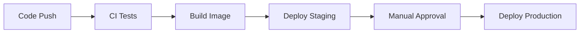

# Task 5: Deployment Strategy

## Deployment overview

Deployment is handled by:

```text
.github/workflows/deploy.yml
scripts/deploy.sh
```

The deployment workflow runs after the `Docker Image` workflow completes
successfully.

## Deployment flow



Text version:

```text
Code Push -> CI Tests -> Build Image -> Deploy Staging -> Manual Approval -> Deploy Production
```

## Environments

### Staging

Staging deploys automatically when the Docker image workflow succeeds for the
`develop` branch.

```yaml
if: ${{ github.event.workflow_run.conclusion == 'success' && github.event.workflow_run.head_branch == 'develop' }}
environment:
  name: staging
```

### Production

Production deploys when the Docker image workflow succeeds for `main`.

This repo also allows `master` because the current local branch is `master`.

```yaml
if: ${{ github.event.workflow_run.conclusion == 'success' && (github.event.workflow_run.head_branch == 'main' || github.event.workflow_run.head_branch == 'master') }}
environment:
  name: production
```

Manual approval is configured through GitHub Environment protection rules.

## Environment protection rules

Configure production approval in GitHub:

1. Open the repository on GitHub.
2. Go to `Settings > Environments`.
3. Create or open the `production` environment.
4. Enable `Required reviewers`.
5. Add the reviewer account that must approve production deployments.

The `production` deployment job will pause until the reviewer approves it.

The `staging` environment should not require reviewers if auto-deploy is
desired.

## Deployment script

The script accepts:

```text
scripts/deploy.sh <environment> <image> <port>
```

Example:

```bash
scripts/deploy.sh staging ghcr.io/owner/repo:commit-sha 8001
```

The script:

- Pulls the Docker image.
- Removes the previous container for the environment.
- Starts a new container.
- Checks `/health`.
- Exits with success or failure status.

## Health check verification

After the container starts, the script checks:

```text
http://127.0.0.1:<port>/health
```

The deployment fails if the endpoint does not return a successful HTTP response
within 30 attempts.

## Deployment status notifications

Each deployment job writes a status summary to GitHub Actions using
`GITHUB_STEP_SUMMARY`.

The summary includes:

- Deployment status.
- Docker image tag.
- Health check URL.

GitHub also records deployment status under the configured environment:

- `staging`
- `production`
